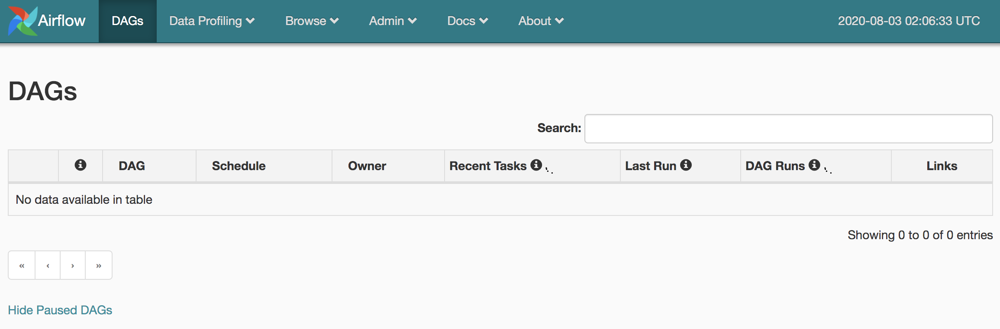

아래 설치 명령들은 우분투를 기반으로 한다.

http://www.marknagelberg.com/getting-started-with-airflow-using-docker/

## Docker 설치

먼저 Docker를 설치하기 위헤 apt 패키지 매니저 자체를 업데이트하고 설치를 진행한다.

```
$ sudo apt-get update
$ sudo apt install -y docker.io
$ sudo systemctl start docker
$ sudo systemctl enable docker
$ docker --version
```

다음으로 hello-world를 실행하여 설치가 제대로 되었는지 확인한다. 출력문에 "Hello from Docker!"가 있어야 한다.

```
$  sudo docker run hello-world
```


## Airflow 설치

먼저 dags 폴더를 하나 만든다. 이 폴더 아래 Python으로 만든 DAG 코드가 존재해야 한다.
```
$ pwd
/home/ubuntu/
$ mkdir dags
$ ls -tl
total 4
drwxrwxr-x 2 ubuntu ubuntu 4096 Aug  3 02:43 dags
```

### Docker를 이용해 Airflow 설치

간단 설치 방법:

```
$ sudo docker pull puckel/docker-airflow
```

Airflow가 설치된 Docker 이미지 이름을 보는 방법 (puckel/docker-airflow를 찾는다)

```
$ sudo docker images 
REPOSITORY              TAG                 IMAGE ID            CREATED             SIZE
puckel/docker-airflow   latest              ce92b0f4d1d5        5 months ago        797MB
hello-world             latest              bf756fb1ae65        7 months ago        13.3kB
```

더 자세히 설치하려면 https://medium.com/@xnuinside/quick-guide-how-to-run-apache-airflow-cluster-in-docker-compose-615eb8abd67a를 참고

### Airflow 실행

다음으로 이 폴더를 dags 폴더로 지정해서 Airflow를 실행한다.
```
sudo docker run -d -p 8080:8080 -v /home/ubuntu/dags:/usr/local/airflow/dags puckel/docker-airflow webserver
```

### Airflow 웹서버 방문

http://호스트이름:8080/




## 기타 


### Airflow Container 실행 중단하기

먼저 Airflow Docker instance의 이름을 알아낸다. "sudo docker ps"를 명령을 실행하여 NAMES 컬럼밑에 나오는 이름을 기억한다. 여기서는 angry_wu인데 매번 바뀐다는 점에 유의한다.

```
$ sudo docker ps
CONTAINER ID        IMAGE                   COMMAND                  CREATED             STATUS              PORTS                                        NAMES
a56dbb111b5b        puckel/docker-airflow   "/entrypoint.sh webs…"   21 minutes ago      Up 21 minutes       5555/tcp, 8793/tcp, 0.0.0.0:8080->8080/tcp   angry_wu
```

이 이름을 가지고 중단한다

```
$ sudo docker stop angry_wu
```

### data-engineering repo내의 HelloWorld.py를 Airflow로 올리기

/home/ubuntu에서 아래를 실행

```
$ git clone https://github.com/keeyong/data-engineering.git
```

다음으로 data-engineering/dags/HelloWorld.py를 /home/ubuntu/dags 폴더로 복사

```
cp data-engineering/dags/HelloWorld.py /home/ubuntu/dags/
```

Airflow를 중단하기 위해 Docker Container의 이름을 알아낸다.

```
$ sudo docker ps
CONTAINER ID        IMAGE                   COMMAND                  CREATED             STATUS              PORTS                                        NAMES
a56dbb111b5b        puckel/docker-airflow   "/entrypoint.sh webs…"   21 minutes ago      Up 21 minutes       5555/tcp, 8793/tcp, 0.0.0.0:8080->8080/tcp   angry_wu

$ sudo docker stop angry_wu
```

Airflow를 재실행한다.
```
sudo docker run -d -p 8080:8080 -v /home/ubuntu/dags:/usr/local/airflow/dags puckel/docker-airflow webserver
```

### Docker 내 Airflow DAG 폴더로 이동하기

이는 DAG 개발을 위해서 필요하다. 먼저 "sudo docker ps"를 명령을 실행하여 NAMES 컬럼밑에 나오는 이름을 기억한다. 

```
$ sudo docker ps
CONTAINER ID        IMAGE                   COMMAND                  CREATED             STATUS              PORTS                                        NAMES
a56dbb111b5b        puckel/docker-airflow   "/entrypoint.sh webs…"   21 minutes ago      Up 21 minutes       5555/tcp, 8793/tcp, 0.0.0.0:8080->8080/tcp   angry_wu
```

이 이름을 가지고 "sudo docker exec -ti"으로 컨테이너 안으로 이동한다.

```
$ sudo docker exec -ti angry_wu bash
airflow@a56dbb111b5b:~$ pwd
/usr/local/airflow
airflow@a56dbb111b5b:~$ cd dags
```
#### 개발

여기에서 ls -tl과 같은 명령을 실행해보면 HelloWorld.py를 볼 수 있어야 한다 (앞서 과정을 거쳤다면). 새로운 DAG 개발을 원한다면 여기서 파이썬 코드 파일을 만든다. 근데 Docker는 기본적으로 아무런 에디터 설치가 되어 있지 않다. 아래와 같이 vim을 설치해 사용한다:

```
apt-get update
apt-get install vim
```


#### Airflow 명령 실행

여기서 여러가지 airflow 명령어들을 실행해볼 수 있다. 예를 들어 list_dags를 실행하면 현재 설치되어 있는 모든 DAG들이 리스트된다.
```
airflow@a56dbb111b5b:~$ airflow list_dags
-------------------------------------------------------------------
DAGS
-------------------------------------------------------------------
example_bash_operator
example_branch_dop_operator_v3
example_branch_operator
example_complex
example_external_task_marker_child
example_external_task_marker_parent
example_http_operator
example_passing_params_via_test_command
example_pig_operator
example_python_operator
example_short_circuit_operator
example_skip_dag
example_subdag_operator
example_subdag_operator.section-1
example_subdag_operator.section-2
example_trigger_controller_dag
example_trigger_target_dag
example_xcom
latest_only
latest_only_with_trigger
test_utils
tutorial
my_first_dag
```

 - "airflow list_tasks DAG이름"을 실행하면 DAG에 속한 태스크들의 이름이 모두 나열된다. 
 - 특정 태스트를 실행하고 싶다면 예를 들어 task ID가 print_hello라면 "airflow test DAG이름 print_hello 2020-08-09" 이렇게 실행하면 된다. 여기서 주의할 점은 2020-08-09의 경우 DAG의 start_date보다는 뒤어야 하지만 현재 시간보다 미래이면 안된다.
